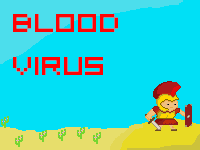
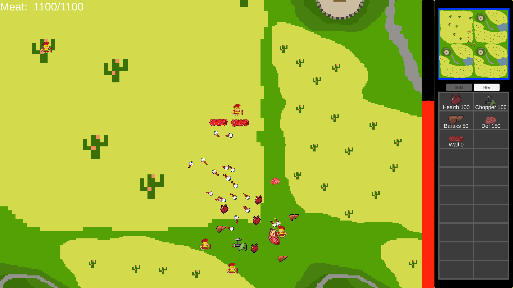
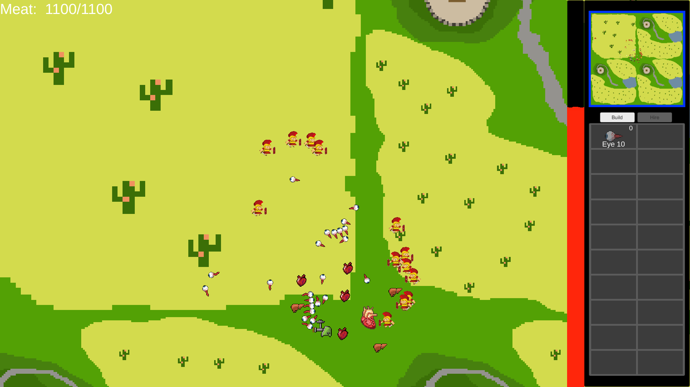
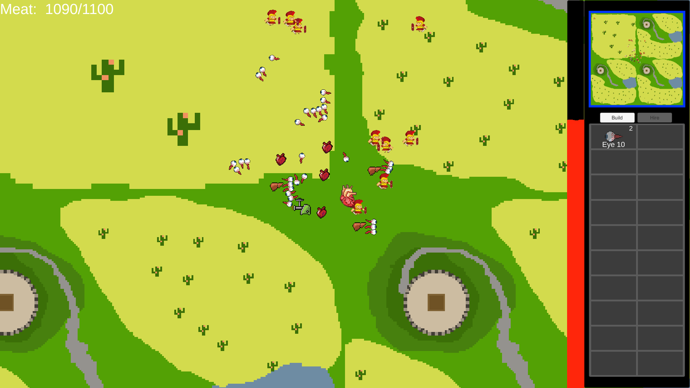

# LD44(BloodVirus)
 

Link to jam entry: https://ldjam.com/events/ludum-dare/44/bloodvirus

You are in the middle age virus created by evil magician. Protect your main heart and destroy naughty humans. Buy new buildings and hire units.

* WASD keys to move camera
* Use mouse drag & RMB to control units. They will attack automatically, if the enemy is nearby
* Click on building in right panel to build it. After building image become filled click on it again and place it.
* Click on build/hire buttons to change panel layout. You can hire units after building barracks. Barracks can be build after blood producer
* Do not let blood pressure become low than zero, by building more blood producers

**Play game in 1920x1080, becouse UI can completly broke in smaller resolution**

*Tips:*
* Main heart - produce blood and meat
* Blood producer - produce blood
* Meat producer -  produce meat
* Barracks - allow to hire eye
* Defence center - allow to build wall
* Wall - just block way for enemies

* Eye - basic and only one unit in game. In 2 times weaker than enemy

Credits:

[@Team-on](https://github.com/Team-on) - Programming

[@Long-as-Python](https://github.com/Long-as-Python) - Sprites & Art

Sweet screenshot)

 
 
 
